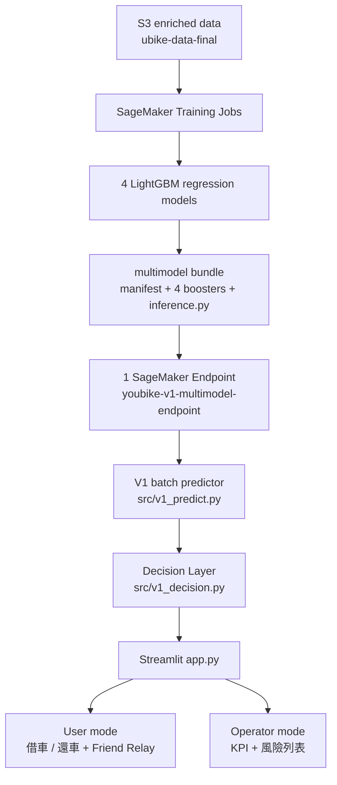

# 🚲 YouBike 預測式供需調度系統

利用 **AWS SageMaker** 與 **LightGBM** 預測站點未來 **30 / 60 分鐘**的車輛占比，
提前以使用者 **Friend Relay** 與營運調度降低**空車 / 滿車**風險。

---

## 1. 問題

交通局在意的不是「現在缺幾台車」，而是：

- **尖峰時段**站點會不會失衡
- **交通節點**與**高使用潛力區域**（捷運 / 公車 / 學校周邊）的服務品質
- 使用者到站時**借得到車、還得到位**
- **短暫失衡**其實不一定值得派車
- **持續性失衡**才值得優先投入調度成本

這個系統要回答的是：*哪些站點的失衡會「撐住」，因此值得現在就動作。*

> 本專案沒有官方「繁榮區」ground truth，因此一律使用中性描述
> （`transport_hub_priority`、`high_usage_potential`），不宣稱具備該分類標籤。

---

## 2. 核心設計：從 classifier 改成 regression

V0 訓練兩個 classifier（shortage / full）。正式 **V1 改為單一 regression target**：

```
future_bike_ratio = future_available_bikes / future_total_docks
```

分母使用**未來那筆觀測自己的**總車柱數。同站點、依 timestamp 排序、實際檢查時間差：

| 模型 | future delta |
| --- | --- |
| 30 分鐘 | 25 ≤ Δt ≤ 35 分 |
| 60 分鐘 | 55 ≤ Δt ≤ 65 分 |

不使用 `shift(-1)` / `shift(-2)`，避免把 60 分鐘的間隔誤當成 30 分鐘。

**Business event 定義固定，不參與校準：**

| 事件 | 條件 | 意義 |
| --- | --- | --- |
| low-bike | `ratio < 0.20` | 空車風險（借不到車） |
| high-occupancy | `ratio > 0.80` | 滿車風險（沒有空位可還） |
| normal | `0.20 ≤ ratio ≤ 0.80` | 正常 |

一個 ratio 可以同時解讀兩端服務風險，這是改用 regression 最大的好處。

**持續性風險：** 30m 與 60m 都落在同一 risk zone → `persistent`。

> ⚠️ 我們只預測 **30 與 60 分鐘兩個離散 horizon**。正確措辭是
> 「30 分鐘與 60 分鐘後皆預測處於低車量／高占用區間，因此判定具有持續性風險」，
> **不宣稱中間整整一小時都持續缺車或滿車**。

---

## 3. 系統架構



---

## 4. 四個正式模型

| 模型 | 資料 | features | Training Job |
| --- | --- | --- | --- |
| `weekday_30m_bike_ratio` | 2026-05 平日 | 14 | `weekday-30m-bike-ratio-enr-1789263106` |
| `weekday_60m_bike_ratio` | 2026-05 平日 | 14 | `weekday-60m-bike-ratio-enr-1789266895` |
| `weekend_30m_bike_ratio` | 2026-05 假日 | 13 | `weekend-30m-bike-ratio-enr-1789266896` |
| `weekend_60m_bike_ratio` | 2026-05 假日 | 13 | `weekend-60m-bike-ratio-enr-1789267182` |

平日／假日直接沿用資料提供者已切好的兩個 enriched 檔案，**未自行用
`timestamp.weekday()` 重新推導**。

**為什麼假日只有 13 個 feature：** 假日 enriched 檔案本身**沒有 `尖峰時段` 欄位**。
因此假日模型不含 `is_peak`，也**沒有 fabricated `is_peak = 0`**。

---

## 5. Features

| Feature | 類型 | 說明 |
| --- | --- | --- |
| `current_available_bikes` | 動態 | 當下可借車數 |
| `current_available_docks` | 動態 | 當下可還空位 |
| `total_docks` | 靜態 | 總車柱數 |
| `current_bike_ratio` | 動態 | 當下車輛占比 |
| `hour` | 時間 | 由 timestamp 拆出 |
| `weekday` | 時間 | 由 timestamp 拆出 |
| `lon` | 空間 | 經度 |
| `lat` | 空間 | 緯度 |
| `nearest_junior_high_distance` | 靜態 | 最近國中小高中距離 |
| `nearest_university_distance` | 靜態 | 最近大專院校距離 |
| `nearest_mrt_distance` | 靜態 | 最近捷運出入口距離 |
| `nearest_bus_distance` | 靜態 | 最近公車站距離 |
| `rainfall` | 動態 | 降雨量 mm |
| `is_peak` | 動態 | 尖峰時段（**僅平日模型**） |

`lon` / `lat` 作為 **spatial feature**，用來捕捉尚未被交通節點距離等特徵完全描述的
區域供需差異。**這不是 causal feature**，只是區域位置的代理變數。

**明確排除：** `平均溫度_°C`（無法確認預測時點可得，避免 temporal leakage）、
`時段`（與 `hour` 重複）、`來源檔案`、station 原始字串、timestamp 原始值。

---

## 6. 正式模型結果

Validation 為時間切分後的後 20%（chronological，非隨機）。

### Regression + 空車風險（low-bike，事件 `ratio < 0.20`）

| Model | MAE | RMSE | R² | Low P | Low R | Low F1 | Low AUC |
| --- | --- | --- | --- | --- | --- | --- | --- |
| weekday_30m | 0.0754 | 0.1158 | **0.7664** | 0.8469 | 0.8232 | **0.8348** | **0.9396** |
| weekday_60m | 0.1024 | 0.1450 | 0.6344 | 0.8154 | 0.7035 | 0.7553 | 0.9012 |
| weekend_30m | 0.0776 | 0.1152 | **0.7663** | 0.8228 | 0.7953 | **0.8088** | **0.9380** |
| weekend_60m | 0.1055 | 0.1460 | 0.6242 | 0.7875 | 0.6529 | 0.7139 | 0.8956 |

### 滿車風險（high-occupancy，事件 `ratio > 0.80`）

| Model | High P | High R | High F1 | High AUC |
| --- | --- | --- | --- | --- |
| weekday_30m | 0.7262 | 0.2104 | 0.3262 | 0.9304 |
| weekday_60m | 0.6839 | 0.0544 | 0.1008 | 0.8812 |
| weekend_30m | 0.7376 | 0.2573 | 0.3816 | 0.9393 |
| weekend_60m | 0.7472 | 0.0893 | 0.1596 | 0.8921 |

**誠實說明 high-occupancy：** AUC 仍然高（0.88–0.94），代表模型**排序能力沒問題**；
但在固定 0.80 門檻下 recall 偏低（0.05–0.26），precision / recall trade-off 明顯。
原因是真實 `ratio > 0.80` 事件只佔約 3% 的資料，而 regression 點估計很少預測到極端值。
因此系統另外校準了**預警觸發門檻**（見下），並沒有把 high-side 包裝成漂亮數字。

### 校準後的預警觸發門檻

Business event 永遠固定 0.20 / 0.80；只校準「預測值要多少才發預警」：

| Model | low alert | high alert |
| --- | --- | --- |
| weekday_30m | `< 0.21` | `> 0.62` |
| weekday_60m | `< 0.25` | `> 0.65` |
| weekend_30m | `< 0.22` | `> 0.65` |
| weekend_60m | `< 0.25` | `> 0.55` |

這些門檻只作為 **early-warning metadata**，UI 的高／中／低分級用它界定「中」，
但持續性風險判定仍使用固定的 0.20 / 0.80。

---

## 7. 持續性風險邏輯

| 30m | 60m | 狀態 |
| --- | --- | --- |
| low | low | `persistent_low` 持續空車風險 |
| low | normal | `transient_low` 短暫低車量 |
| normal | low | `emerging_low` 風險形成中 |
| high | high | `persistent_high` 持續滿車風險 |
| high | normal | `transient_high` 短暫高占用 |
| normal | high | `emerging_high` 風險形成中 |
| 其他 | | `normal` |

邊界慣例：`ratio == 0.20` 與 `ratio == 0.80` 都算 **normal 側**（事件為嚴格不等式）。

---

## 8. 使用者模式

1. 選 **我要借車** / **我要還車**（預設還車）
2. 輸入 **目的地**（地址或地標，例如 `SOGO 忠孝館`）
3. 選搜尋範圍（100m / 300m / **500m** / 1km / 2km）
4. 看附近最多 5 站，含 30 分鐘 / 60 分鐘風險與**獎勵金**

**風險語意隨模式切換**（一般使用者不會同時看到兩種風險）：

| 模式 | 風險代表 |
| --- | --- |
| 我要借車 | 借不到車的風險（空車風險） |
| 我要還車 | 沒有空位可還的風險（滿車風險） |

| 站點名稱 | 距離 | 可借/可還 | 30分鐘風險 | 60分鐘風險 | 獎勵金 |
| --- | --- | --- | --- | --- | --- |
| 三井Outlet（最近） | 0m | 可還 21 | 🟢 低 | 🟢 低 | — |
| 新北市林口行政園區 | 295m | 可還 8 | 🟢 低 | 🟢 低 | **+$10** |

### Friend Relay

**不是**大型「系統推薦卡」。獎勵金直接顯示在站點列表最右欄，使用者自己看到哪一站
有回饋金，這就是 nudge。

```
reward = 5 + 5 × (extra_distance / 300)      限定 0 < extra_distance ≤ 300m
```

`extra_distance` = 該站距離 − 最近可行站距離。結果 clip 在 **$5 ～ $10**，四捨五入成整數。
超過 300m 額外繞行不提供回饋金。

| 模式 | 獎勵哪一種站 | 為什麼 |
| --- | --- | --- |
| 借車 | `persistent_high` / `emerging_high` | 從未來高占用站借走車，釋放車柱 |
| 還車 | `persistent_low` / `emerging_low` | 把車還到未來缺車站，補充供給 |

> 回饋金為 **Demo incentive policy 示意**，不是交通局正式核定政策，也不涉及
> 真實帳號、金流或票券 API。

---

## 9. 營運中心

**KPI：** 高風險站點數 / 持續空車風險站 / 持續滿車風險站 / 目前監控站點

**主表格：**

| 站點名稱 | 站點地址 | 30分鐘滿車風險 | 1小時滿車風險 | 30分鐘空車風險 | 1小時空車風險 |
| --- | --- | --- | --- | --- | --- |

風險一律以 **高 / 中 / 低**（🔴 / 🟡 / 🟢）呈現，不把 regression ratio 當百分比機率展示。
預設依風險排序（持續性 → 形成中 / 短暫 → 正常），並提供行政區 / 風險程度 / 站點搜尋篩選。

---

## 10. AWS 實作

| 服務 | 用途 |
| --- | --- |
| **S3** | enriched 訓練資料、model artifacts、training channels |
| **SageMaker Training** | 4 個正式 LightGBM training jobs |
| **SageMaker Endpoint** | **1 個** multimodel real-time endpoint |

- Endpoint：`youbike-v1-multimodel-endpoint`
- Region：`us-west-2`
- Instance：`ml.m5.large` × 1
- Container：`sagemaker-scikit-learn:1.2-1`（Python 3.8．LightGBM 4.6.0 由
  `code/requirements.txt` 安裝）

四個模型放在**同一個 Endpoint**，由 request 的 `day_type` + `horizon_minutes` 路由，
而不是開四個 Endpoint。

---

## 11. Batch inference

**不是每站個別 invoke。** 一個 snapshot（實測 1,159 站）：

```
30m batch  → 1 次 invoke_endpoint
60m batch  → 1 次 invoke_endpoint
────────────────────────────────
合計         2 次
```

已用 N = 1 / 10 / 500 驗證請求數**不隨站數線性成長**。這是正式 V1 相對早期
station-by-station 版本（1,526 次請求）最重要的改進。

---

## 12. Parity 驗證

| 驗證 | 範圍 | max abs diff |
| --- | --- | --- |
| Bundle 本機 parity | 4 models × 5,000 真實 validation rows | **0.0** |
| Live AWS endpoint parity | 4 routes × 500 rows | **0.0** |

代表打包後的 multimodel endpoint 推論結果與原始正式 booster **完全一致**
（不是「在容差內」，是 0.0）。同時驗證：平日 route 用 14 features、假日 route 用
13 features、假日不注入 `is_peak`、無效 `day_type` / `horizon` 會被拒絕。

---

## 13. 版本與 Git

| Tag / Branch | Commit | 說明 |
| --- | --- | --- |
| `stable-decision-v1` | `4dd9d0b` | V0 本機 stable MVP（XGBoost + Decision Layer） |
| `stable-cloud-demo-v0` | `ab53279` | V0 SageMaker 雲端保底 Demo |
| `stable-v1-training` | 本分支 | 正式 V1 開發 / Demo 分支 |

V0 仍完整保留並作為 **fallback**：V1 Endpoint 不可用時 app 會明確提示並改用 V0。

---

## 14. Quick start

```powershell
git clone <repo-url>
cd hackathon

python -m venv .venv
.venv\Scripts\activate
pip install -r requirements.txt
```

設定 AWS 憑證（**請填入自己的值，不要把真實憑證寫進任何檔案**）：

```powershell
$Env:AWS_DEFAULT_REGION="us-west-2"
$Env:AWS_ACCESS_KEY_ID="<YOUR_ACCESS_KEY>"
$Env:AWS_SECRET_ACCESS_KEY="<YOUR_SECRET_KEY>"
$Env:AWS_SESSION_TOKEN="<YOUR_SESSION_TOKEN>"
```

驗證身分與 Endpoint：

```powershell
.venv\Scripts\python.exe -c "import boto3; print(boto3.client('sts', region_name='us-west-2').get_caller_identity())"
.venv\Scripts\python.exe -c "import boto3; print(boto3.client('sagemaker', region_name='us-west-2').describe_endpoint(EndpointName='youbike-v1-multimodel-endpoint')['EndpointStatus'])"
```

啟動 Demo：

```powershell
.venv\Scripts\streamlit run app.py
```

瀏覽器開啟 <http://localhost:8501>。

若 Endpoint 不可用，app 會顯示
`V1 SageMaker Endpoint unavailable，已切換至 Stable V0。` 並改用 V0 介面
（**不會 silent fallback，也不會 crash**）。

---

## 15. Endpoint lifecycle 與成本

> ⚠️ real-time Endpoint 只要處於 **InService 就持續計費**（`ml.m5.large` 約
> **US$0.115 / 小時**）。Demo 結束請務必刪除。

| 動作 | 指令 |
| --- | --- |
| 重建 bundle | `v1_training\venv\Scripts\python.exe deploy_v1\build_bundle.py` |
| 本機 parity | `v1_training\venv\Scripts\python.exe deploy_v1\parity_test.py` |
| 上傳 + 部署 Endpoint | `v1_training\venv\Scripts\python.exe deploy_v1\deploy_endpoint.py` |
| **刪除 Endpoint（停止計費）** | `v1_training\venv\Scripts\python.exe deploy_v1\delete_endpoint.py` |

`delete_endpoint.py` **只刪除 Endpoint**，會保留 SageMaker Model、Endpoint Config、
S3 artifact 與 IAM role，因此之後可直接用 `deploy_endpoint.py` 重建，不需重新打包或重訓。

正式 model artifact 已存放於 S3（`s3://.../v1-deploy/`），3.2 MB 的 bundle binary
**不納入 Git**，可由 `deploy_v1/build_bundle.py` 重建。

---

## 16. Demo cases

實際從資料中找出來的真實情境（非 hardcode），完整操作步驟見
[`v1_training/DEMO_RUNBOOK.md`](v1_training/DEMO_RUNBOOK.md)。

**還車情境（Return）** — 平日尖峰，搜尋範圍 500m

```
目的地：三井Outlet
最近可行站：三井Outlet                      獎勵金 —
有回饋金：新北市林口行政園區                 persistent_low
額外繞行 294.8m                            獎勵金 +$10
```

**借車情境（Borrow）** — 平日尖峰，搜尋範圍 500m

```
目的地：捷運江子翠站(1號出口)
最近可行站：捷運江子翠站(1號出口)            獎勵金 —
有回饋金：捷運江子翠站(6號出口)              persistent_high
額外繞行 168.4m                            獎勵金 +$8
```

---

## 17. Demo 資料說明（重要）

**目前 UI 使用歷史 enriched snapshot，不是 live YouBike feed。**

| Snapshot | Timestamp | 站點數 |
| --- | --- | --- |
| 平日（尖峰） | `2026-05-28 07:30:36` | 1,159 |
| 假日 | `2026-05-31 19:30:32` | 1,159 |

原因：正式 V1 模型需要 `rainfall` 與 `is_peak`，而 V0 的 runtime snapshot 不含這兩欄。
為了**不 fabricate** 這些值，Demo 改用真實歷史情境。

- `rainfall` / `is_peak` 皆為該時間點的**真實 observation**
- **沒有任何 fabricated value**
- UI 每個畫面都標示 `Demo 情境時間`
- 這**不是** live production system

Snapshot 為 ~90 KB parquet，因此 Streamlit 啟動時**不需要**讀 1.1 GB 的 enriched CSV。

---

## 18. 已知限制

- 正式 V1 目前只使用 **2026-05 一個月**資料（時間受限的取捨；`--force-months` 支援擴充）
- **runtime 國定假日判斷尚未實作**：`day_type` 目前只用 calendar（Mon–Fri / Sat–Sun），
  記錄為 `day_type_source = calendar_weekday_demo_rule`。訓練用的假日資料集其實包含國定假日
- Demo 使用 **historical snapshot**，非即時資料
- **站點地址**：原始資料沒有街道地址欄位，因此使用 `城市 + 行政區 + 場站名稱`；
  缺資料時顯示「地址資料未提供」，**不 fabricate 地址**
- **回饋金為 Demo policy**，非正式核定政策
- **Friend Relay 缺乏真實 user-level intervention data**，因此目前展示的是
  decision mechanism，**不宣稱已完成 causal validation**（無法證明「使用者真的因此改變行為」）
- **high-occupancy 預警的 precision / recall trade-off 較大**（見第 6 節）
- 資料涵蓋新北市；輸入台北市地標（如 `SOGO 忠孝館`）會落到涵蓋範圍內的預設地點，
  **不會產生假站點**
- `current_bike_ratio` 是最強的特徵，模型相對 persistence baseline
  （直接假設 30 分鐘後不變）主要改善的是 RMSE（大誤差），MAE 改善幅度小。
  未來可加入 lag / rolling 動能特徵

---

## 19. 測試

```powershell
.venv\Scripts\python.exe -m pytest tests -q
```

**178 passed**，涵蓋：

| 範圍 | 內容 |
| --- | --- |
| V0 regression | 原有 data loader / features / intervention / decision / explain |
| V1 backend | feature schema、routing、response validation、fallback contract |
| Decision Layer | 7 種 temporal state、0.20 / 0.80 邊界 |
| Batch | N = 1 / 10 / 500 皆為 2 次請求 |
| UI logic | 借車/還車風險語意、四個 operator 風險欄位、KPI、排序 |
| Reward | 邊界（0m、300m、>300m）與 $5–$10 範圍 |

> 測試**全部 mock AWS**，不會呼叫真實 Endpoint。
> Live AWS 驗證（endpoint parity、Streamlit smoke）是**另外獨立執行**的，
> 兩者在報告中不混為一談。

---

## 20. 專案結構

```
app.py                      Streamlit 入口（V1 優先，V0 fallback）
src/
  config.py                 集中設定（門檻、路徑、backend 開關）
  data_loader.py            V0 CSV 清理
  features.py               V0 特徵工程 / target
  train.py                  V0 XGBoost 訓練
  predict.py                V0 單站預測
  intervention.py           V0 派車 + Friend Relay 2.0 + Decision Layer
  explain.py                選用的自然語言說明層（預設關閉）
  sagemaker_predict.py      V0 XGBoost endpoint adapter
  v1_predict.py             ★ V1 multimodel endpoint adapter（batch / schema / fallback）
  v1_decision.py            ★ V1 temporal risk + operator priority
  v1_ui.py                  ★ V1 UI 邏輯（風險分級 / 附近站 / 回饋金）
  v1_app.py                 ★ V1 Streamlit rendering
deploy/                     V0 XGBoost 部署腳本
deploy_v1/                  ★ V1 multimodel 打包 / 部署 / parity / 刪除
  code/inference.py         Endpoint handler（四模型路由）
v1_training/                ★ V1 訓練 pipeline
  v1_core/                  audit / prep / modeling / pipeline
  runtime/                  小型 Demo runtime artifacts（station + snapshots）
  DEMO_RUNBOOK.md           Demo 操作步驟
tests/                      178 tests
```

（`.venv`、raw CSV、training parquet、model binary、logs 皆不納入 Git。）

---

## 21. 設計原則

- **無洩漏**：特徵只用當下與過去資訊；train / validation 依時間切分，不用 random split
- **事件定義與觸發門檻分離**：business event 固定 0.20 / 0.80，只校準預警觸發點
- **不 fabricate**：缺少的 feature 一律明確 reject，不用 0 或平均值補
- **可解釋**：規則式 Decision Layer，不疊第二個 ML model
- **誠實措辭**：只有兩個 horizon 就不宣稱整個小時，沒有 ground truth 就不宣稱分類
- **原始資料唯讀**：pipeline 不修改 `dataset/` 或 S3 raw objects
