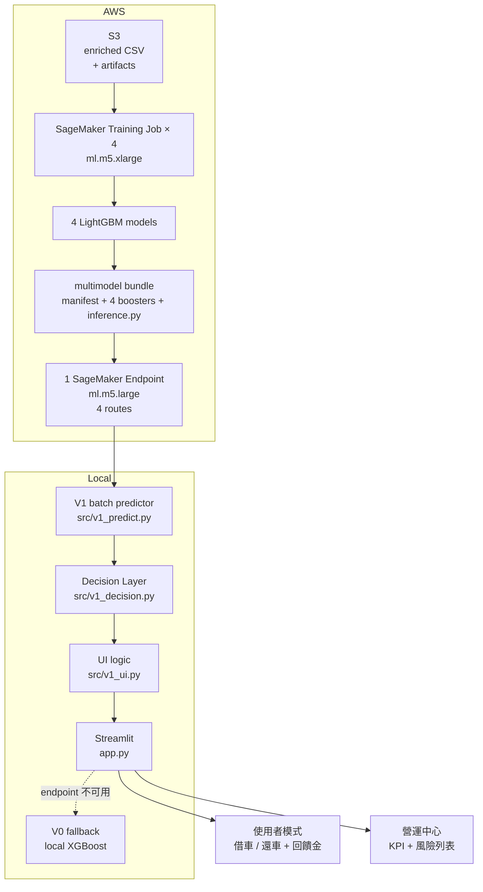

# 🚲 YouBike 預測式供需調度系統

> 預測公共自行車站點**未來 30 / 60 分鐘**的車輛占比，在失衡真正發生前，
> 以**使用者協作**與**營運調度**兩種介入手段降低「借不到車」與「還不進去」的機率。
>
> 訓練與推論部署於 **AWS SageMaker**，模型為 **LightGBM regression**，
> 前端為 **Streamlit** 雙角色介面（一般使用者 / 營運中心）。

新北市 AWS 黑客松專案。本文件為結案後整理的正式版說明。

---

## 目錄

- [1. 專案目標](#1-專案目標)
- [2. 問題背景](#2-問題背景)
- [3. 核心方法](#3-核心方法)
- [4. 系統架構](#4-系統架構)
- [5. 模型與成效](#5-模型與成效)
- [6. 互動介面](#6-互動介面)
- [7. 專案結構](#7-專案結構)
- [8. 環境](#8-環境)
- [9. 如何啟動互動介面](#9-如何啟動互動介面)
- [10. 工程實作重點](#10-工程實作重點)
- [11. 已知限制](#11-已知限制)
- [12. 測試](#12-測試)

---

## 1. 專案目標

打造一個**可實際操作**的預測式調度系統，而不只是一份模型準確度報告。三個具體目標：

| 目標 | 交付成果 |
| --- | --- |
| **預測** 站點未來供需狀態 | 4 個 LightGBM regression 模型（平日／假日 × 30／60 分鐘） |
| **判斷** 哪些失衡值得投入成本 | 規則式 Decision Layer，區分持續性／短暫／形成中風險 |
| **介入** 讓一般人也能參與調度 | 雙角色 Streamlit 介面 + Friend Relay 回饋金機制 |

設計上刻意選擇**可解釋**而非追求最高分數：規則式決策層、樹模型、固定超參數，
讓營運人員能理解「為什麼系統建議派車」。

---

## 2. 問題背景

公共自行車的痛點不是車不夠多，而是**車在錯誤的時間出現在錯誤的地點**。

**使用者視角**：走到站點卻沒車可借，或騎到目的地卻沒有空位可還。
兩者都發生在「已經出發之後」，此時才知道就太晚了。

**營運視角**：調度車輛有實際成本（人力、油耗、車輛週轉）。但

- 有些失衡只是**短暫尖峰**，10 分鐘後自然恢復 → 派車是浪費
- 有些失衡會**持續下去** → 值得優先處理

現行做法多為「事後反應」：等站點空了才派車。本專案要回答的是：

> **哪些站點的失衡會「撐住」，因此現在就值得動作？**

這也是為什麼系統同時預測 **30 分鐘與 60 分鐘**兩個時間點——
單一時間點無法區分「短暫」與「持續」。

> 註：本專案沒有官方的「熱門區域」分類標籤，因此一律使用中性描述
> （`transport_hub_priority`、`high_usage_potential`），不宣稱具備該分類。

---

## 3. 核心方法

### 3.1 從分類改為迴歸

初版曾訓練兩個 classifier（缺車 / 滿站）。正式版改為**單一 regression target**：

```
future_bike_ratio = 未來時點的可借車數 / 未來時點的總車柱數
```

分母使用**未來那筆觀測自己的**容量（而非當下容量），避免站點擴充造成偏差。

**為什麼改用 regression？** 一個連續的 ratio 可以同時解讀**兩端**服務風險：

| 事件（固定業務定義） | 條件 | 使用者感受 |
| --- | --- | --- |
| low-bike（空車） | `ratio < 0.20` | 借不到車 |
| high-occupancy（滿車） | `ratio > 0.80` | 沒有空位可還 |
| normal | `0.20 ≤ ratio ≤ 0.80` | 正常 |

好處：**一個模型支援兩種營運需求**，且門檻可事後調整而**不需重新訓練**。
以站點總容量正規化後，大站與小站也能用同一尺度比較。

### 3.2 Target 建構（嚴格時間窗）

同一站點、依 timestamp 排序，實際檢查時間差：

| 模型 | 合法 future delta |
| --- | --- |
| 30 分鐘 | 25 ≤ Δt ≤ 35 分 |
| 60 分鐘 | 55 ≤ Δt ≤ 65 分 |

以 `pandas.merge_asof(direction="nearest", tolerance=5min, by=station)` 實作。

**刻意不使用 `shift(-1)` / `shift(-2)`**：原始資料的觀測間隔不固定，
盲目位移會把 60 分鐘的間隔誤當成 30 分鐘。實測四個模型
「Δt 落在窗外」的丟棄數皆為 **0**，證明窗口嚴格生效。

不合法的資料**全部丟棄，不補值**：

| 情況 | 處理 |
| --- | --- |
| 找不到對應時間窗的未來觀測 | 丟棄 |
| `future_total_docks ≤ 0` | 丟棄 |
| ratio 超出 `[0, 1]` | 記錄數量後丟棄（**不 silent clip**） |

> 為什麼不 clip？因為 clip 會把資料品質問題藏起來。
> 一筆 `可借車數 > 總車柱數` 代表來源有問題，我們讓它可見（記在 metadata）而不是抹平。

### 3.3 持續性風險判斷

結合兩個 horizon 產生七種狀態：

| 30m | 60m | 狀態 | 營運意義 |
| --- | --- | --- | --- |
| low | low | `persistent_low` | 持續空車 → 值得派車補車 |
| low | normal | `transient_low` | 短暫 → 可能不用動 |
| normal | low | `emerging_low` | 形成中 → 先用使用者引導 |
| high | high | `persistent_high` | 持續滿車 → 值得移車疏解 |
| high | normal | `transient_high` | 短暫尖峰 |
| normal | high | `emerging_high` | 形成中 |
| 其他 | | `normal` | 不介入 |

邊界慣例：`ratio == 0.20` 與 `ratio == 0.80` 皆屬 **normal 側**（事件為嚴格不等式），
並有專門的單元測試鎖住此行為。

> **措辭紅線**：我們只預測兩個離散時間點，因此只能說
> 「30 分鐘與 60 分鐘後**皆預測**處於低車量區間，因此判定具有持續性風險」，
> **不能說**「未來一小時都會持續缺車」——中間的 31–59 分鐘並沒有預測。

### 3.4 事件定義與預警觸發分離

這是本專案在方法論上最重要的一個設計決定。

| | 業務事件定義 | 預警觸發點 |
| --- | --- | --- |
| 由誰決定 | 營運政策（**固定不動**） | 資料校準（每模型不同） |
| 套用對象 | 真實 ratio | **模型預測值** |
| 用於 | 標記事件、判定持續性風險 | 發出預警、UI 中間帶 |

**為什麼要分開？** regression 是點估計，預測值分布比真實值窄，
極少輸出 `> 0.80` 這種極端值。若直接用事件門檻當觸發點，會漏掉大量真實事件。

| 模型 | 事件定義 | 校準後觸發點 |
| --- | --- | --- |
| weekday_30m | low `<0.20` / high `>0.80` | low `<0.21` / high `>0.62` |
| weekday_60m | 同上 | low `<0.25` / high `>0.65` |
| weekend_30m | 同上 | low `<0.22` / high `>0.65` |
| weekend_60m | 同上 | low `<0.25` / high `>0.55` |

早期版本曾用「同一個門檻同時當事件定義與觸發點」來做 sweep，
後來發現這會讓 F1 變成事件盛行率的單調函數，導致「最佳門檻」永遠落在網格邊緣。
修正後**事件定義固定、只掃描觸發點**，各候選的 Precision／Recall 才可直接比較。

---

## 4. 系統架構



**四模型單一 Endpoint 的設計理由**：四個模型的服務契約完全相同
（輸入站點特徵、輸出 future_bike_ratio），僅差在平假日與 horizon。
因此以 request 中的 `day_type` + `horizon_minutes` 路由，容器啟動時一次載入四個 booster。

| 面向 | 效益 |
| --- | --- |
| 成本 | 只付一台 `ml.m5.large`，而非四台 |
| 部署複雜度 | 一組 Model / Config / Endpoint，重建只需一個步驟 |
| 版本一致性 | 四模型永遠同一版打包，不會出現部分更新的漂移 |

---

## 5. 模型與成效

四個正式模型，資料為 **2026-05**，**時間序切分** 80/20（非隨機切分）。

| 模型 | 資料 | features | train | validation |
| --- | --- | --- | --- | --- |
| `weekday_30m_bike_ratio` | 平日 | 14 | 863,994 | 216,855 |
| `weekday_60m_bike_ratio` | 平日 | 14 | 839,308 | 210,659 |
| `weekend_30m_bike_ratio` | 假日 | 13 | 474,887 | 119,273 |
| `weekend_60m_bike_ratio` | 假日 | 13 | 461,009 | 116,175 |

平假日直接沿用資料提供方已切好的兩份檔案，**未自行以 `weekday()` 重新推導**。
假日模型少一個特徵，是因為假日資料集本身**沒有「尖峰時段」欄位**，
因此**未偽造 `is_peak = 0`**。

### 迴歸表現與空車風險

| 模型 | MAE | RMSE | R² | Low P | Low R | Low F1 | Low AUC |
| --- | --- | --- | --- | --- | --- | --- | --- |
| weekday_30m | 0.0754 | 0.1158 | **0.7664** | 0.8469 | 0.8232 | **0.8348** | **0.9396** |
| weekday_60m | 0.1024 | 0.1450 | 0.6344 | 0.8154 | 0.7035 | 0.7553 | 0.9012 |
| weekend_30m | 0.0776 | 0.1152 | **0.7663** | 0.8228 | 0.7953 | **0.8088** | **0.9380** |
| weekend_60m | 0.1055 | 0.1460 | 0.6242 | 0.7875 | 0.6529 | 0.7139 | 0.8956 |

### 滿車風險（誠實揭露）

| 模型 | 事件盛行率 | High P | High R | High F1 | High AUC |
| --- | --- | --- | --- | --- | --- |
| weekday_30m | 3.23% | 0.7262 | 0.2104 | 0.3262 | 0.9304 |
| weekday_60m | 3.23% | 0.6839 | 0.0544 | 0.1008 | 0.8812 |
| weekend_30m | 3.91% | 0.7376 | 0.2573 | 0.3816 | 0.9393 |
| weekend_60m | 3.90% | 0.7472 | 0.0893 | 0.1596 | 0.8921 |

**滿車側是本專案最明顯的弱點。** AUC 有 0.88–0.94，代表**模型排序能力沒問題**；
但在固定 0.80 門檻下 recall 僅 0.05–0.26。根因是真實 `ratio > 0.80` 事件只佔 3–4%，
而 regression 點估計極少輸出極端值。校準觸發點後（weekday_30m 用 `>0.62`）
recall 可從 0.21 拉到 0.75，代價是 precision 降至 0.24。

完整的 threshold sweep 保存於各模型的 `threshold_analysis.json`，
可依營運端對誤派車的容忍度隨時切換，**不需重新訓練**。

### 與 persistence baseline 的比較（重要且誠實）

在 weekday_30m 的 216,855 筆驗證資料上，若完全不用模型、直接假設「30 分鐘後 = 現在」：

| | MAE | RMSE | R² |
| --- | --- | --- | --- |
| persistence（猜不變） | 0.0758 | 0.1303 | 0.7042 |
| 本專案 LightGBM | **0.0754** | **0.1158** | **0.7664** |
| 改善 | 0.5% | **11.1%** | +0.062 |

**解讀**：MAE 幾乎沒贏，但 RMSE 贏 11.1%。意思是
**模型的價值在削掉「大幅變動」的誤差**——而這正是營運上真正在意的情況
（會突然被騎空或被塞滿的站）。平穩的站本來就好猜。

### 特徵重要性（gain，自已訓練 booster 讀出）

以 weekday_30m 為例：

| 排名 | 特徵 | gain 佔比 |
| --- | --- | --- |
| 1 | `current_bike_ratio` | **78.93%** |
| 2 | `current_available_bikes` | 9.01% |
| 3 | `current_available_docks` | 6.58% |
| 4 | `total_docks` | 1.15% |
| 5 | `hour` | 1.05% |
| 6 | `nearest_mrt_distance` | 0.88% |
| 7 | `lon` | 0.52% |
| 8 | `lat` | 0.45% |
| 9–14 | 其他 POI 距離、`is_peak`、`rainfall`、`weekday` | 各 < 0.5% |

三個「當下狀態」特徵合計 **94.5%**。值得注意的觀察：

- **60 分鐘模型更依賴情境特徵**：`hour` 從 1.05% → 3.15%，
  `nearest_mrt_distance` 從 0.88% → 2.36%，而 `current_bike_ratio` 從 78.93% → 71.52%。
  時間越遠，「現況」的預測力衰減，模型自動改用時段與空間結構。
- **`lon` / `lat` 佔比低**（0.37–1.39%，排第 7/8），代表模型**並未**過度依賴「記住站點位置」。
- **`is_peak` 僅 0.21%**，資訊幾乎已被 `hour` 涵蓋——這也解釋了為何假日模型
  少這個特徵卻幾乎沒有損失（weekend_30m R² 0.7663 ≈ weekday_30m 0.7664）。

> ⚠️ **Feature importance 代表模型使用程度，不代表因果影響。**
> `lon` 高不代表「經度造成車輛短缺」，它只是區域位置的代理變數。

### 特徵清單

| 特徵 | 類型 | 說明 |
| --- | --- | --- |
| `current_available_bikes` | 動態 | 當下可借車數 |
| `current_available_docks` | 動態 | 當下可還空位 |
| `total_docks` | 靜態 | 總車柱數 |
| `current_bike_ratio` | 動態 | 當下車輛占比 |
| `hour` / `weekday` | 時間 | 由 timestamp 拆出 |
| `lon` / `lat` | 空間 | 區域位置代理 |
| `nearest_junior_high_distance` | 靜態空間 | 最近國中小高中距離 |
| `nearest_university_distance` | 靜態空間 | 最近大專院校距離 |
| `nearest_mrt_distance` | 靜態空間 | 最近捷運出入口距離 |
| `nearest_bus_distance` | 靜態空間 | 最近公車站距離 |
| `rainfall` | 環境 | 降雨量 mm |
| `is_peak` | 時間 | 尖峰時段（**僅平日模型**） |

**明確排除**：`平均溫度`（無法確認預測時點可得，避免 temporal leakage）、
`時段`（與 `hour` 重複且更粗）、`來源檔案`、站名原始字串、timestamp 原始值。

---

## 6. 互動介面

### 使用者模式

1. 選擇 **我要借車** / **我要還車**
2. 輸入**目的地**（地址或地標）
3. 選搜尋範圍（100m / 300m / **500m** / 1km / 2km）
4. 顯示附近最多 5 站的 30 / 60 分鐘風險與**回饋金**

**風險語意隨模式切換**，一般使用者不會同時看到兩種風險：

| 模式 | 風險代表 |
| --- | --- |
| 我要借車 | 借不到車的風險（空車風險） |
| 我要還車 | 沒有空位可還的風險（滿車風險） |

| 站點名稱 | 距離 | 可借/可還 | 30分鐘風險 | 60分鐘風險 | 回饋金 |
| --- | --- | --- | --- | --- | --- |
| 三井Outlet（最近） | 0m | 可還 21 | 🟢 低 | 🟢 低 | — |
| 新北市林口行政園區 | 295m | 可還 8 | 🟢 低 | 🟢 低 | **+$10** |

### Friend Relay 回饋金機制

**設計取捨**：早期版本有一張大型「系統推薦卡」，後來移除。
改為在站點列表最右欄直接顯示回饋金——使用者自己看到哪一站有錢，
這本身就是 nudge，比命令式推薦更貼近真實產品。

```
extra_distance = 該站距離 − 最近可行站距離
reward = 5 + 5 × (extra_distance / 300)     限定 0 < extra_distance ≤ 300m
         clip 至 [5, 10] 並取整
```

| 模式 | 獎勵哪種站 | 為什麼有效 |
| --- | --- | --- |
| 借車 | `persistent_high` / `emerging_high` | 從即將滿站的站借走車 → **釋放車柱** |
| 還車 | `persistent_low` / `emerging_low` | 把車還到即將缺車的站 → **補充供給** |

關鍵：使用者**本來就要借／還車**，系統只是引導他換一個站，
繞行上限 300 公尺。超過就不給回饋金（要求太多，使用者不會接受）。

> 回饋金為 **Demo 激勵政策示意**，非正式核定政策，不涉真實帳號或金流。

### 營運中心

**KPI**：高風險站點數 / 持續空車風險站 / 持續滿車風險站 / 目前監控站點

**主表格**（依風險排序，持續性風險優先）：

| 站點名稱 | 站點地址 | 30分鐘滿車風險 | 1小時滿車風險 | 30分鐘空車風險 | 1小時空車風險 |
| --- | --- | --- | --- | --- | --- |

風險一律以 **高 / 中 / 低**（🔴 / 🟡 / 🟢）呈現，
**不把 regression ratio 當百分比機率展示**（它不是機率）。
提供行政區 / 風險程度 / 站點搜尋篩選。

---

## 7. 專案結構

```
app.py                       Streamlit 入口（V1 優先，V0 fallback）
requirements.txt             執行環境依賴

src/
  config.py                  集中設定：門檻、路徑、backend 開關
  data_loader.py             V0 原始 CSV 清理（cp950 / utf-8-sig）
  features.py                V0 特徵工程與 30 分鐘 target
  train.py                   V0 XGBoost 訓練
  predict.py                 V0 單站預測（shortage / full 機率）
  intervention.py            V0 派車建議 + Friend Relay + Decision Layer
  explain.py                 選用的自然語言說明層（預設關閉）
  sagemaker_predict.py       V0 XGBoost endpoint adapter
  v1_predict.py            ★ V1 endpoint adapter：batch / schema 驗證 / 錯誤契約
  v1_decision.py           ★ V1 七種 temporal risk 狀態 + 營運優先度
  v1_ui.py                 ★ V1 UI 純邏輯：風險分級 / 附近站搜尋 / 回饋金
  v1_app.py                ★ V1 Streamlit 畫面組裝

models/                      V0 已訓練模型（XGBoost JSON + feature_meta）

deploy/                      V0 XGBoost 部署腳本（打包 / 上傳 / endpoint 生命週期）

deploy_v1/                 ★ V1 multimodel 部署
  code/inference.py          Endpoint handler：四模型路由、per-model 特徵順序
  build_bundle.py            打包四模型為單一 artifact
  parity_test.py             本機 parity 驗證
  deploy_endpoint.py         上傳 → Model → Config → Endpoint → AWS parity
  delete_endpoint.py         只刪 Endpoint（保留 Model / Config / artifact）

v1_training/               ★ V1 訓練與分析
  v1_core/                   audit / prep / modeling / pipeline（可重用模組）
  runtime/                   小型 runtime artifacts（站點靜態特徵 + demo 快照）
  build_station_features.py  由 enriched CSV 建 1,583 站靜態特徵表
  build_demo_snapshot.py     建 demo 情境快照
  find_demo_cases.py         從真實資料找可展示的 demo case
  run_enriched_aws.py        正式 SageMaker 訓練入口
  DEMO_RUNBOOK.md            Demo 操作步驟
  DEFENSE_BRIEF.md           技術問答補充（超參數、特徵重要性、限制）

tests/                       178 個測試
```

★ 為正式 V1 新增模組。V0 完整保留並作為 fallback。

未納入版控：`.venv`、原始 CSV（`dataset/`）、訓練用 parquet、
模型 binary bundle、logs、快取。

---

## 8. 環境

Python **3.13**，Windows PowerShell 為主要開發環境。

```powershell
python -m venv .venv
.venv\Scripts\activate
pip install -r requirements.txt
```

| 套件 | 用途 |
| --- | --- |
| `streamlit` | 互動介面 |
| `pandas` / `numpy` | 資料處理 |
| `xgboost` | V0 本機模型推論 |
| `scikit-learn` | 評估指標 |
| `boto3` | 呼叫 SageMaker endpoint |
| `pyarrow` | 讀取 demo 快照 parquet |
| `matplotlib` | V0 訓練圖表 |

> `lightgbm` **不在** 執行環境依賴中——V1 推論由 AWS endpoint 執行，
> 本機不需載入 LightGBM。若要重跑 V1 訓練，
> `v1_training/` 使用獨立的虛擬環境（見 `DEMO_RUNBOOK.md`）。

---

## 9. 如何啟動互動介面

### 先了解兩種執行模式

`app.py` 啟動時會自動偵測 AWS V1 endpoint：

| 情況 | 行為 |
| --- | --- |
| endpoint 為 `InService` | 使用 **V1**（4 個 LightGBM，30/60 分鐘雙 horizon） |
| endpoint 不存在 / 無憑證 | **明確顯示提示**後改用 **V0**（本機 XGBoost，30 分鐘單 horizon） |

fallback 會在畫面上顯示
`V1 SageMaker Endpoint unavailable，已切換至 Stable V0。`
——**不是靜默切換，也不會 crash**。

### 模式 A：V1（需 AWS 憑證與 endpoint）

```powershell
$Env:AWS_DEFAULT_REGION="us-west-2"
$Env:AWS_ACCESS_KEY_ID="<YOUR_ACCESS_KEY>"
$Env:AWS_SECRET_ACCESS_KEY="<YOUR_SECRET_KEY>"
$Env:AWS_SESSION_TOKEN="<YOUR_SESSION_TOKEN>"
```

確認身分與 endpoint 狀態：

```powershell
.venv\Scripts\python.exe -c "import boto3; print(boto3.client('sts', region_name='us-west-2').get_caller_identity())"
.venv\Scripts\python.exe -c "import boto3; print(boto3.client('sagemaker', region_name='us-west-2').describe_endpoint(EndpointName='youbike-v1-multimodel-endpoint')['EndpointStatus'])"
```

啟動：

```powershell
.venv\Scripts\streamlit run app.py
```

瀏覽器開啟 <http://localhost:8501>。

> ⚠️ **本專案原始的 AWS 環境為黑客松臨時帳號，該 endpoint 已不再對外可用。**
> 若要重現 V1，需在自己的 AWS 帳號重新部署：
>
> ```powershell
> v1_training\venv\Scripts\python.exe deploy_v1\build_bundle.py      # 打包四模型
> v1_training\venv\Scripts\python.exe deploy_v1\parity_test.py       # 本機 parity
> v1_training\venv\Scripts\python.exe deploy_v1\deploy_endpoint.py   # 部署 + AWS parity
> ```
>
> 需自行調整 `deploy_v1/deploy_endpoint.py` 中的 S3 bucket、IAM role ARN 與帳號。

### 模式 B：V0（純本機，不需 AWS）

V0 模型已隨版控提供（`models/` 下三個檔案），但**原始 CSV 未納入版控**
（資料量 1.1 GB 等級）。因此需自行放入資料：

```
dataset/新北AWS黑克松競賽0329-31.csv 的副本.csv
```

檔名與編碼設定於 `src/config.py`（`DEFAULT_CSV_NAME`、`DATA_ENCODING`）。
放入後直接啟動即可，不需設定任何 AWS 憑證：

```powershell
.venv\Scripts\streamlit run app.py
```

若模型檔缺失，App 會提示先執行訓練而非崩潰：

```powershell
.venv\Scripts\python.exe -m src.train
```

### Endpoint 生命週期與成本

> ⚠️ SageMaker real-time endpoint 只要處於 `InService` 就**持續計費**
> （`ml.m5.large` 約 US$0.115／小時）。**用完務必刪除。**

```powershell
v1_training\venv\Scripts\python.exe deploy_v1\delete_endpoint.py
```

此腳本**只刪除 Endpoint**，保留 SageMaker Model、Endpoint Config、
S3 artifact 與 IAM role，因此可用 `deploy_endpoint.py` 直接重建，
不需重新打包或重新訓練。

---

## 10. 工程實作重點

這一節記錄幾個「不寫出來看不出價值」的實作決定。

### Batch inference：請求數不隨站數成長

早期版本對每個站點各打一次 endpoint。1,159 個站需要
**1,526 次** HTTP 請求，Demo 會卡住數分鐘。

正式版把整個 snapshot 打包成兩次請求：

```
30 分鐘 batch → 1 次 invoke_endpoint
60 分鐘 batch → 1 次 invoke_endpoint
──────────────────────────────────
合計            2 次（與站點數無關）
```

已用 N = 1 / 10 / 500 驗證請求數不隨站數線性成長，
並以 `st.cache_data` 快取，避免 Streamlit rerun 重複推論。

### Parity 驗證：逐位元一致

| 驗證層級 | 範圍 | max absolute difference |
| --- | --- | --- |
| 本機 bundle | 4 模型 × 5,000 筆真實驗證資料 | **0.0** |
| 線上 AWS endpoint | 4 routes × 500 筆 | **0.0** |

**不是「在容差內」，是 0.0。** 意義：打包成單一 endpoint 後的推論結果，
與原始訓練產出的 booster 完全相同，UI 顯示的數字就是模型真正的輸出，
沒有任何打包或路由造成的偏移。

同時驗證：平日 route 用 14 features、假日 route 用 13、
假日**不注入** `is_peak`、無效 `day_type` / `horizon` 會被拒絕。

### 部署過程實際踩過的坑

| 問題 | 根因 | 解法 |
| --- | --- | --- |
| Endpoint ping health check 失敗 | `SAGEMAKER_SUBMIT_DIRECTORY` 指向 S3 tar，導致 `inference.py` 落在巢狀路徑，`import inference` 失敗 | 改指向容器內本機路徑 `/opt/ml/model/code` |
| Training job `ExitCode 1` | sklearn container 未內建 pyarrow，`read_parquet` 拋 ImportError | 改用 CSV channel，不增加容器依賴 |
| 修正後仍失敗 | S3 channel prefix 殘留舊的 `train.parquet`，SageMaker 會下載該前綴下**所有**物件 | reader 改為「CSV 優先，有 CSV 就跳過 parquet」+ 使用全新 run-tagged prefix |
| `XGBClassifier.load_model()` 失敗 | container 的 scikit-learn 1.8 移除了 `_estimator_type` | 改用低階 `Booster` API，完全不依賴 sklearn |

所有根因皆由 CloudWatch Logs 追出最內層 exception，非猜測。

### 不 fabricate 的原則

系統多處刻意選擇「明確失敗」而非「補一個看起來合理的值」：

- 假日 payload 若帶入 `is_peak` → **拒絕**（該模型未用此特徵訓練）
- 平日 payload 若缺 `is_peak` → **拒絕**
- 缺少任何必要特徵 → 明確報錯並列出缺哪些，**不以 0 或平均值填補**
- 站點無街道地址 → 顯示 `城市 + 行政區 + 站名`，或「地址資料未提供」
- ratio 異常值 → 記錄數量後丟棄，不 clip

---

## 11. 已知限制

主動列出，並附改善方向。

| 限制 | 影響 | 下一步 |
| --- | --- | --- |
| 訓練資料僅 **2026-05 單月** | 可能未涵蓋季節性 | enriched 檔實際有 5 個完整月份，`--force-months` 可直接擴充 |
| Demo 使用**歷史快照**，非即時資料 | 不是 live 系統 | 接 open data，並補上 rainfall / is_peak 的即時來源 |
| **國定假日 runtime 判斷未實作** | 國定假日會被當平日路由 | 接行政機關辦公日曆；`day_type_source` 欄位已預留 |
| **Friend Relay 無使用者層級因果驗證** | 無法證明使用者真的改變行為 | 需 A/B test 或推薦接受率資料 |
| 滿車事件**類別極不平衡**（3–4%） | recall 低，或需犧牲 precision | 試 `scale_pos_weight`、quantile regression |
| `lon`/`lat` 對**新站泛化未驗證** | 不能主張可預測全新站點 | spatial holdout + ablation |
| **未做超參數調校** | 分數非上限 | `best_iteration=800` 打到樹數上限、early stopping 從未觸發，代表仍在欠擬合側 |
| **無 lag / rolling 動能特徵** | MAE 僅勝 persistence 0.5% | 加入前 30／60 分鐘變化量、同站同時段歷史均值 |

其中兩點特別值得說明：

**「只用一個月」是時間預算下的取捨，不是資料不足。** 優先確保四個模型
真的訓練完成、部署為單一 endpoint、通過 parity、並接上可操作介面。
`best_iteration` 打到 800 上限且 early stopping 從未觸發，
反向證明模型仍在欠擬合側——擴充資料應能繼續改善。

**Friend Relay 目前能證明的是「決策機制」，不是「行為改變」。**
Demo case 是從 1,159 站的真實預測中找出來的（非 hardcode），
系統能正確識別「哪個站未來會缺車、該引導誰、繞行多少值多少錢」。
但「使用者是否真的因此改道」需要實驗資料，本專案沒有。

---

## 12. 測試

```powershell
.venv\Scripts\python.exe -m pytest tests -q
```

**178 passed**

| 範圍 | 內容 |
| --- | --- |
| V0 regression | 資料清理、特徵、target、介入建議、Decision Layer |
| V1 backend | 特徵 schema、route 驗證、response 驗證、錯誤契約 |
| Decision Layer | 七種 temporal state、`0.20` / `0.80` 邊界 |
| Batch | N = 1 / 10 / 500 皆為 2 次請求 |
| UI 邏輯 | 借／還車風險語意、四個營運風險欄位、KPI、排序 |
| Reward | 邊界（0m、300m、>300m）與 $5–$10 範圍 |

> 測試**全部 mock AWS**，不會呼叫真實 endpoint。
> 線上驗證（endpoint parity、Streamlit 實機操作）為**獨立執行**，兩者不混為一談。

---

## 版本

| Tag / Branch | 說明 |
| --- | --- |
| `stable-decision-v1` | V0 本機穩定版（XGBoost + 規則式介入） |
| `stable-cloud-demo-v0` | V0 雲端保底版（SageMaker batch inference） |
| `stable-v1-training` | 正式 V1（4 模型 + 單一 endpoint + 雙角色 UI） |

---

## 設計原則

- **無洩漏**：特徵只用當下與過去資訊；train / validation 依時間切分，不用隨機切分
- **事件定義與觸發門檻分離**：業務定義固定，只校準預警觸發點
- **不 fabricate**：缺少的特徵一律明確拒絕，不以 0 或平均值填補
- **可解釋優先**：規則式決策層，不疊第二個 ML 模型
- **誠實措辭**：只有兩個 horizon 就不宣稱整個小時；沒有 ground truth 就不宣稱分類
- **原始資料唯讀**：pipeline 不修改 `dataset/` 或 S3 原始物件
